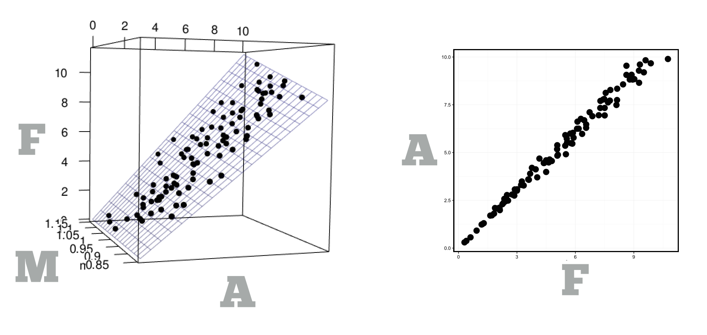

O'Reilly publishes nine books on data science and one of them is named "What is Data Science?" When you open any of these books you should ask yourself, what am I getting into? As a term, data science has come to mean several things. 

At one level, data science is a _body of knowledge_, a collection of useful information related to a specific task. For example, library science and managerial science are bodies of knowledge. Library science collects the best ways to run a library, and managerial science collects the best ways to run a business. Data science collects the best ways to store, retrieve, and manage data. As a result, a data scientist might know how to set up a hadoop cluster or run the latest type of non-relational database. This is probably what most people think of when they think of "data science," but this is not the type of data science that I will teach you.

At another level, data science is a way of doing science. Data scientists use data, models, and visualizations to make scientific discoveries, just as other scientists use experiments. In fact, you can think of data science as a _method_ of science that complements experimental science. Experimental scientists use the experimental method to solve scientific problems, and data scientists use the data science method. Many scientists use both. 

This book will teach you the method of data science. You will learn how to use data to make scientific discoveries, and to justify those discoveries once they are made. Along the way, you will learn how to visualize data, build models, and make predictions.

This chapter will describe the problems that data scientists attempt to solve, as well as the method that they use to solve them. It introduces data science as a specific method of reasoning that matches the structure of data to the structure of natural laws. This method of reasoning guides the techniques that you will learn in later chapters—techniques like machine learning, statistical modelling, and visualization.

## A method of science

As a method of science, data science is based on two simple ideas. First, that the best way to learn about the word is to observe it. And second, that the universe operates according to _natural laws_. 

A natural law is a law-like relationship between variables, like $$E = Mc^{2}$$ and $$F = MA$$. Natural laws explain how the values of variables relate to each other, which can help scientists understand, control, and make predictions about natural processes.

For example, $$E = Mc^2$$ states that the energy content of a system ($$E$$) is always equal to the mass of the system ($$M$$) multiplied by the speed of light squared ($$c^{2}$$). $$F = MA$$ explains that the force exerted upon an object ($$F$$) is equal to the mass of the object ($$M$$) multiplied by its acceleration ($$A$$), an insight that has many applications in the field of physics. 

Natural laws deal with variables and values. We use these terms in everyday speech, but they have a technical meaning when associated with data science.

* A _variable_ is a quantity, quality, or property that can be measured. 

* A _value_ is the state that you observe when you measure a variable. The value of a variable may change from measurement to measurement.

Throughout the book, I will refer to variable names with a capital letter and individual values with a lower case letter. So for example, I would refer to the force acting on a particle as $$F$$, as in $$F=MA$$. If I measured the force I would refer to the value I observer as $$f$$, the value of variable $$F$$. In data science, it is common to measure a variable on multiple occasions. You might observe a different value on each occasion. To keep these values straight, I will use a subscript, e.g. $$f_{1}$$ , $$f_{2}$$, etc. The subscripts denote when we measure each variable. $$f_{1}$$ is the value of $$F$$ that we measure on occasion one, and $$f_{2}$$ is the value of $$F$$ that we measure on occasion two.

Natural laws provide a goal for science. Scientists attempt to discover natural laws and thereby explain natural phenomena. You can think of science as a collection of methods that use observations to discover natural laws. Data science is one of those methods, and experimental science is another. The two methods differ in how they handle the phenomenon of variation.

## Variation

_Variation_ is the natural tendency for a value to change from measurement to measurement. Quantities like the temperature of the air and the salinity of the sea change from moment to moment and from place to place. Properties of objects, like height, weight, or volume, change from object to object. If you look closely at the same quantity twice, you will notice these changes, even if the changes are small.

Variation provides an easy way to discover natural laws. When two variables are related by a natural law, their values will seem to correspond to each other. When the value of one variable changes, the value of the other variables will respond in a way that preserves the form of the natural law. For example, if the force acting on a particle increases, then the mass or acceleration of the particle must also increase to preserve the relationship $$F=MA$$. This relationship is known as _covariation_, the tendency for two or more variables to vary in a systematic way. 

Scientists discover natural laws by identifying variables that covary. They work out the form of laws by measuring how each variable fluctuates in response to each other.

Variation provides a mechanism for revealing laws, but it also creates uncertainty. Suppose you wish to determine whether the local factory causes ozone pollution in your town. You measure the amount of ozone in the air on Day 1, when the factory is open for business and running full steam. Then you measure the ozone on Day 2, when the factory is closed for business.

You discover that the ozone is much lower on Day 2 than Day 1. Case closed, right? Or is it?

Due to natural variation, _many_ things changed from Day 1 to Day 2. These changes may have caused the drop in ozone (and the factory may be innocent). What might have changed? Atmospheric conditions, like temperature, humidty, and wind speed, which affectthe creation and accumulation of ozone; traffic conditions, like the number of cars on the road, whihc provide a competing source of ozone; or unknown conditions, like the arrival of a hairspray convention, which could alter ozone levels without ever drawing our attention.

Scientists account for the uncertainty caused by variation in two different ways. Experimental scientists _control_ variation to eliminate uncertainty. Data scientists _analyze_ variation to understand uncertainty. You can understand data science more easily if you contrast it with the more straightforward practices of experimental science.

## Experimental science

Experiments are designed to control all sources of variation except one: the response variable. The explanatory variable is purposefully varied. All other variables are held constant.

When a scientist runs an experiment, he or she creates a controlled environment that eliminates every source of variation accept for one, the source being studied. In other words, an experimental scientist holds competing sources of variation constant, which allows them to directly observe the effect of the variable under study.

This technique is very useful for revealing causal relationships. An experimental scientist can directly observe the effects caused by changing the explanatory variable. Moreover, an experimental scientist can feel certain that the effects are caused by the expanatory variable because he or she has eliminated all competing sources of variation.

As a method, experimental science has been immensely successful. In fact, it what many of us are taught as "the scientific method" in elementary school. However, experimental science has two weak points.

First, the experimental method can only reveal causal relationships, but many useful relationships are not causal. Consider the old sailor's motto, "Red at night, sailor's delight; red in the morning, sailor take warning." The saying is more than a colorful rhyme. It refers to atmospheric conditions associated with weather.

Sunrise will feature red clouds when the skies are clear to the east (where the sunrises) and moisture laden to the west, where clouds will reflect back the sun's red rays. Since weather patterns tend to move from west to east, these conditions suggest that rain and perhaps storms are on their way. 

In contrast, sunset will feature red clouds when the skies are clear to the west and moisture laden clouds are to the east. These conditions suggest that rain is moving away and clear skies are on their way. 

The saying was useful to people who did not have access to modern meterology because it contained predictive value. However, red skies do not cause poor or fair weather. They are a side effect of moisture in the air. This makes the relationship difficult to test experimentally. However, if you merely wait to observe red skies and note their outcome, you loose the important aspect of an experiment, the ability to control competing sources of variation.

The experimental method also has a second weakness: it is very difficult to control many sources of variation. Consider how hard it would be to do an experiment that isolates the effect of one policy on one aspect of the economy. Consider how immoral it would be to do a study that measures the effect of second hand smoke on infant well being.

Data science presents a compliment to experimental science. Data science cannot prove causality and it cannot directly reveal relationships beyond the shadow of a doubt. However, data science _can_ reveal non-causal relationships, and it provides a way to deal with variation that cannot be controlled.

To see how data science works, consider how a lack of control affects three scientific tasks: measurement, discovery, and proof.

## Measurement

Scientists believe that the speed of light is a universal constant that should never vary. In fact, Einsteinian relativity shows that the universe will distort space and time to preserve the speed of light. This is probably the most drastic effort to preserve the value of a constant that I can think of. However, if you were to measure the speed of light repeatedly, you would get different values each time—just as Albert Michelson did in 1879, (see the table below). Why should this be?

|------------|------------|------------|------------|------------|------------|------------|------------|------------|------------
| 299,850|    299,740|    299,900|    300,070|    299,930 |    299,800| 299,850|    299,880|    299,900|    299,840
|299,850| 299,950| 299,980| 299,980| 299,880 |299,830| 299,790| 299,810| 299,880| 299,880
|300,000| 299,980| 299,930| 299,650| 299,760 |299,830| 299,800| 299,790| 299,760| 299,800
|299,810| 300,000| 300,000| 299,960| 299,960 |299,880| 299,880| 299,880| 299,860| 299,720
|299,960| 299,940| 299,960| 299,940| 299,880 |299,720| 299,620| 299,860| 299,970| 299,950

_50 measurements of the speed of light (in air) (km/s) observed by Michelson in 1879._

Tiny errors happen when you take measurements. For example, your hand might shake very slightly, or a lens might expand as temperatures change. If you cannot control these errors, they will introduce a source of variation into your measurements.  As a result, even constants will seem to vary from observation to observation, so long as you measure them precisely enough. 

Variation creates uncertainty for scientists because it implies that you cannot know which value you will observe when you measure a variable—even if you have measured the variable before. However, variation also contains information. Each variable has a unique pattern of variation that contains clues about how the variable will behave.

Data sets provide a record of variation that you can use to study a variable. If you look at the recorded values of a variable, you will notice that some values occur quite often, some quite rarely, and others not at all. This pattern of values is known as the _distribution_ of the variable. To see how a distribution can help you reason about a variable, consider the speed of light.

You can reason about the true value of a constant by studying the distribution of values associated with the constant. For example, we can plot the values above on a number line. If two values appear at the same spot on the number line, I'll stack the second value above the first. This will let me place each value at the correct spot on the number line without hiding any of the measurements. 

Each of these measurements attempts to record the same constant value, the speed of light; but each measurement is offset by tiny measurement errors. In some measurements, Albert's hand shook. In some, the lens swelled. In some, both happened at once, and so on.

Distributions reveal that some values occur more than others, some appear quite frequently, some appear less often, and some values do not appear at all.

Data scientists use the information in a distribution as the basis for reasoning with probability. This let's them find the most likely value.

This method of reasoning is known as inference to the best explanation. It is pragmatic -- but not foolproof. For example, in the Michelson data 299,850 km/s seems to be the most likely value of the true speed of light in air, but 299,840 km/s and 299,860 km/s would also seem like reasonable estimates.

Data scientists deal with this ambiguity by using a variable's distribution to account for uncertainty.

It seems likely that large errors will be less common than small ones—the experimenter is trying to avoid errors after all. For a large error to occur, a point would either need to experience a large measurement error (which is unlikely) or several small measurement errorswhich together have a large effect (which is also unlikely). As a result, you would expect many points to be near the true value and fewer points to be far away from it. In fact, you would expect the number of points to drop off as you move further and further away from the true value.

You can use the distribution to estimate the true speed of light. The distribution suggests that the true value of the speed of light is around 299,850 km/s. However, the distribution does not provide fullproof evidence. The variation in the data obscures the value that the points are clustering around. Michelson can guess that the points are clustering around 299,850 km/s, but they could also be clustering around 299,840 or 299,860 km/s. To express this uncertainty, Michelson estimated the speed of light in air to be 299,852±51 km/s. 

The ±51 km/s provides a margin of error. Michelson uses it to suggest that the true speed of light falls somewhere in the interval between 299,801 and 299,903. In other words, any of these values would be reasonable based on the data. 

Estimates and margins of error demonstrate two types of information that you can find in a distribution. You can use a distribution to identify a "typical" value of a variable and to quantify the amount of uncertainty associated with a variable. You can also use a distribution to predict how a variable will behave in the future. Distributions show that some values appear frequently, some values appear rarely, and some values do not appear at all. For example, we can use the distribution above to predict that Michelson would never observe a value above 400,000 km/s—even if he continues to take many more measurements. In Chapter 6, you will see that the information contained in a distribution also form a basis for probability, a toolkit for making exact predictions about the behavior of variables.

Data scientists use distributions to provide insights about variables, but these insights are often vague, a basic ennumeration of possibilities. A second type of variation provides a much more exact tool for prediction and discovery. That type of variation is known as covariation.

This pattern is the hallmark of data science. Data scientists use the distribution of a variable to understand its behavior. From this behavior, they infer the best explanation and then quantify the uncertainty attached to that observation.

You can apply this method to more than estimation. You can use it to discover laws in non-experimental conditions.

## Discovery

Recall that covariation provides a way to discover scientific laws.

Data is itself a remarkable tool for discovering covariation. In fact, it is a record of covariation.

A data set is a collection of values that have been organized in a specific way: each value in a data set is associated with a variable and an observation. 

* An _observation_ is a set of measurements that are made on multiple variables under similar (ideally identical) conditions. 

    You can think of an observation as a snapshot of the world. An observation shows what a group of variables looked like together for a brief moment before they changed. 

This organization gives data a structure that parallels the structure of natural laws. Natural laws deal with variables, but they operate on values that appear in the same observation. For example, the law $$F = MA$$ states that when you measure a particle's force, mass, and acceleration _at the same time_, you will observe a trio of values such that

$$f_{1} = m_{1} * a_{1}$$  

$$f_{2} = m_{2} * a_{2}$$  

$$f_{3} = m_{3} * a_{3}$$  

and so on.

A natural law implies that a relationship will exist between values _in the same observation_. However, natural laws do not imply that a relationship will exist between values in _different_ observations. You wouldn't think that if you measure the force of a particle today, it will equal the mass times the acceleration that you measured tomorrow. All three quantities may change between now and then. In other words, $$f_{1}$$ will be related to $$m_{1}$$ and $$a_{1}$$, but it may not be related to $$m_{3}$$ and $$a_{3}$$. 

The values $$f_{1}$$, $$f_{2}$$, $$f_{3}$$, $$m_{1}$$, $$m_{2}$$, $$m_{3}$$, $$a_{1}$$, $$a_{2}$$, and $$a_{3}$$ compose a data set.

obs | $$F$$     | $$M$$     | $$A$$    
--- | --------- | --------- | ---------
1   | $$f_{1}$$ | $$m_{1}$$ | $$a_{1}$$
2   | $$f_{2}$$ | $$m_{2}$$ | $$a_{2}$$
3   | $$f_{3}$$ | $$m_{3}$$ | $$a_{3}$$

Each value is associated with a variable, as well as an observation. Within each observation, the relationship described by the law $$F = MA$$ is present. As a result, the data set reveals what the natural law implies:

obs | $$F$$     | $$M$$     | $$A$$    
--- | --------- | --------- | ---------
1   | $$f_{1}$$ | $$= m_{1}$$ | $$\times a_{1}$$
2   | $$f_{2}$$ | $$= m_{2}$$ | $$\times a_{2}$$
3   | $$f_{3}$$ | $$= m_{3}$$ | $$\times a_{3}$$

If you examine the data, you may notice that the value of $$A$$ is high whenever the value of $$F$$ is high, and the value of $$A$$ is low when the value of $$F$$ is low. In other words, $$F$$ and $$A$$ covary. 

If you also examine the values of the particle's mass ($$M$$), you will observe an even more striking form of covariation. In each row, the value of $$F$$ exactly equals the value of $$M$$ times the value of $$A$$. This covariation is no surprise. The variables are shaped by the law $$F=MA$$, and the law has left its fingerprints in the data.

Covariation provides a way to discover natural laws. If a law exists between two variables, their values will covary.

If you collect many different observations, the law will appear as a pattern of covariation in your data. You can find patterns of covariation by searching through your raw data, or you can employ two tools that are better suited for the job.

You can discover these patterns in many ways, but one of the easiest ways is to visualize your data.

First, you can visualize your data, which makes low dimensional patterns more apparent. For example, the relationship between $$F$$, $$M$$, and $$A$$ appears as a plane in a three dimensional graph.

Second, you can also search through your data with pattern recognition algorithms, like those of statistical modelling and machine learning. Data scientists describe these techniques in terms of statistics, but the techniques are at heart just computerized methods of spotting patterns in data.

Now consider what happens if you cannot control variation in your data.

If measurement errors occurs, this introduces noise.

You can think of measurement errors as a pair of dice that you roll whenever you take a measurement. Instead of returning the true value of the quantity that you are measuring, your apparatus will return the true value modified by the values on the dice. For symmetry, let's assume one dice contains the numbers one through six, and the other contains the numbers negative one through negative six. We can simulate fifty contaminated measurements of the number 100 by rolling the dice fifty times and adding the results to the number fifty. The results look like the distribution below.

If you do not observe each variable in a system, this creates noise.

If you measure proxy variables, this creates noise. Suppose instead of measuring X you measure Y which is related to X through its own law, $$Y = X + Z$$. This would introduce unexplained variation into the data.

Note how this would never happen in an experiment.

Data scientists handle these sources of variation in the same way as measurement errors. They infer the best relationship between the variables and then describe the distribution of the left over noise. This creates a model.

To make predictions, you can use the model as a baseline and then quantify the uncertainty with the error term.

This method is not as reliable as experimental science, but once again, it is pragmatic. It is the most reasonable thing that you can do.

It is also more flexible than experimental science, especially when it comes to prediction.

The method of inference plus quantifying uncertainty even provides a way to think about "proving" hypotheses, or at least justifying them in the face of uncertainty.

## Proof

Recall Michelson's data again. Can Michelson use it to prove that the speed of light is 299,850 km/s? No.

But Michelson can use the data to compare the strength of different hypotheses. To conclude a hypothesis would be an inference. The distribution of the data tells us which inferences would be best.

Michelson can also rule out many hypotheses as being unlikely. 

This provides a way to test hypotheses: do they seem unlikely given the available data? We can even calculate how likely our test is to get things right and wrong.

It is important to realize that the test cannot prove that a hypothesis is true (in the strict sense, it does not even prove that a hypothesis is false). However, the test is the best we can do in the face of uncertainty (and it is remarkably useful at that).

## Data Science

This then is data science:

* Matching the structure of data to the structure of scientific laws.

* Using inference to the best explanation.

* Quantifying the uncertainty associated with our inferences.

But you need to be able to do more than these things to be able to do data science. Just as a chemist needs to know how to stock a lab, and use a pipet, you need to know

* How to manipulate large data sets by programming a computer

* How to wrangle data

* How to visualize data

* How to explore data

This book will teach you the last three. The first is a topic which deserves its own book. 

## Syllabus

